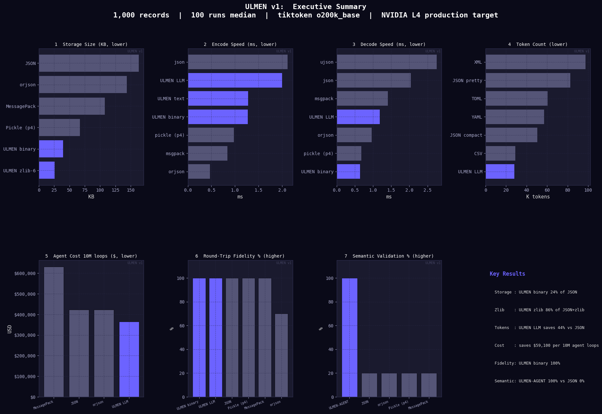

# ULMEN: Ultra Lightweight Minimal Encoding Notation
### The serialization engine built for LLM agentic workflows.
The AI engineering community is currently obsessed with expanding LLM context windows to 1M+ tokens. Meanwhile, teams are burning massive amounts of compute and cloud egress costs because they are orchestrating multi-agent systems using JSON.

We are feeding state-of-the-art intelligence through a 20-year-old, heavily bloated web format.

**ULMEN** is a drop-in Python/Rust/JavaScript serialization engine that treats the LLM context window and network IPC as strict hardware constraints. By natively incorporating exact token-counting, string pooling, and semantic validation at the C/Rust boundary, ULMEN delivers Protobuf-level density without requiring pre-compiled schemas.

**Now available across the entire development ecosystem:**
- **Python**: Full-featured with Rust acceleration
- **JavaScript/TypeScript**: WASM-powered with identical output
- **Node.js, Browser, Deno, Edge**: Universal compatibility

---

## Table of Contents

- [Benchmarks](#benchmarks)
- [At a Glance](#at-a-glance)
- [Surfaces](#surfaces)
- [Installation](#installation)
- [Quick Start](#quick-start)
- [Cross-Platform Usage](#cross-platform-usage)
- [API Reference](#api-reference)
- [Wire Format Constants](#wire-format-constants)
- [Utilities](#utilities)
- [Architecture](#architecture)
- [Running Tests](#running-tests)
- [Format Specification](#format-specification)
- [Documentation](#documentation)
- [Versioning](#versioning)

---

## Benchmarks



Benchmarks run on production-grade constraints (NVIDIA Tesla T4, 16GB VRAM):

- **44% LLM Token Reduction**: Eliminates syntax bloat, saving approximately $59,000 per 10 million agent loops (vs. GPT-4o input costs).
- **3x Faster Reads**: Deserializes heavily nested payloads natively faster than the C-optimized orjson and standard json.
- **4.1x Smaller IPC Footprint**: The pooled binary format drastically reduces microservice network egress and Redis cache saturation.
- **The Semantic Firewall**: Unlike generic formats that silently pass broken traces, the ULMEN-AGENT protocol automatically rejects orphaned tools, backwards steps, and invalid enums before they trigger LLM hallucinations.
- **Universal Compatibility**: Identical performance across Python, JavaScript, Node.js, browsers, and edge runtimes.

---

## At a Glance

```python
# Python
from ulmen import UlmenDictRust, encode_agent_payload
records = [{"id": 1, "name": "Alice", "active": True}]
binary = UlmenDictRust(records).encode_binary_zlib()
```

```javascript
// JavaScript/TypeScript
import { encode, UlmenDict } from 'ulmen';
const records = [{id: 1, name: "Alice", active: true}];
const binary = await encode(records);
```

```python
# ULMEN-AGENT Protocol
from ulmen import encode_agent_payload, compress_context
agent_records = [
    {"type": "msg", "id": "m1", "thread_id": "t1", "step": 1, 
     "role": "user", "content": "Hello", "tokens": 5, "flagged": False}
]
payload = encode_agent_payload(agent_records, context_window=8000)
```

---
## Installation
### python
```bash
# With Rust acceleration (recommended)
pip install ulmen

# Development install
git clone https://github.com/makroumi/ulmen
cd ulmen
pip install maturin
maturin develop --release
```

### JavaScript/TypeScript
```bash
# npm
npm install ulmen

# yarn
yarn add ulmen

# pnpm  
pnpm add ulmen
```
The library automatically detects available acceleration (Rust for Python, WASM for JavaScript) and falls back gracefully to pure implementations.

---
## Quick Start
### Python
```python
from ulmen import UlmenDict, UlmenDictRust, encode_ulmen_llm

records = [
    {"id": 1, "name": "Alice", "city": "London", "score": 98.5, "active": True},
    {"id": 2, "name": "Bob",   "city": "London", "score": 91.0, "active": False},
    {"id": 3, "name": "Carol", "city": "Paris",  "score": 87.3, "active": True},
]

# Binary (smallest)
ld = UlmenDict(records)
binary = ld.encode_binary_pooled()
zlib_compressed = ld.encode_binary_zlib()

# Text (human-readable)
text = ld.encode_text()

# ULMEN (LLM-native)
ulmen = encode_ulmen_llm(records)

# Rust acceleration (drop-in, byte-identical)
ld_rust = UlmenDictRust(records)
binary = ld_rust.encode_binary_pooled()
```

### JavaScript
```javascript
import { encode, encodeZlib, UlmenDict } from 'ulmen';

const records = [
    {id: 1, name: "Alice", city: "London", score: 98.5, active: true},
    {id: 2, name: "Bob", city: "London", score: 91.0, active: false},
    {id: 3, name: "Carol", city: "Paris", score: 87.3, active: true}
];

// Simple encoding
const binary = await encode(records);
const compressed = await encodeZlib(records, 6);

// Class-based API with caching
const ulmen = new UlmenDict(records);
await ulmen.init();
const binary2 = await ulmen.encodeBinary();
const poolSize = await ulmen.poolSize();
```

### TypeScript
```typescript
import { UlmenDict, encode } from 'ulmen';

interface UserRecord {
  id: number;
  name: string;
  score: number;
  active: boolean;
}

const users: UserRecord[] = [
  {id: 1, name: "Alice", score: 98.5, active: true}
];

const binary: Uint8Array = await encode(users);
```

--- 
### Cross-Platform Usage
#### Node.js Backend
```javascript
import { encode } from 'ulmen';
import { writeFileSync } from 'fs';

const data = await fetchFromDatabase();
const binary = await encode(data);
writeFileSync('data.ulmen', binary);
```
#### Browser Frontend
```HTML
<script type="module">
import { encode } from './node_modules/ulmen/dist/index.js';

const data = [{timestamp: Date.now(), message: "Hello"}];
const binary = await encode(data);
console.log(`Encoded: ${binary.length} bytes`);
</script>
```

#### Deno
```javascript
import { encode } from "npm:ulmen";

const data = [{message: "From Deno"}];
const binary = await encode(data);
```

#### Edge Runtime (Cloudflare Workers, Vercel Edge, etc.)
```javascript
import { encode } from 'ulmen';

export default {
  async fetch(request) {
    const data = [{ip: request.headers.get('CF-Connecting-IP')}];
    const binary = await encode(data);
    return new Response(binary);
  }
};
```

### Cross-Language Compability
Data encoded in any language can be decoded by any other language:
```python
# Python encodes
from ulmen import UlmenDictRust
python_binary = UlmenDictRust([{"test": "data"}]).encode_binary()
```
```javascript
// JavaScript decodes (when decoder available)
import { decode } from 'ulmen';
const decoded = await decode(python_binary);

```

## Surfaces

ULMEN exposes four surfaces over a single data model:

### Binary: `LUMB` prefix
Columnar binary format. Smallest on wire. Designed for storage and IPC.
Supports delta encoding, bitpacking, RLE, string pooling, and zlib.

### Text: `records[N]:` prefix
Line-oriented, diff-friendly, human-readable. Compatible with standard
text tools. Uses the same pool and strategy system as binary.

### ULMEN: `L|` prefix
LLM-native CSV surface. Every payload is self-describing via a typed
header line. Language models can read and generate ULMEN without
special training or prompt engineering.

### Streaming: `UlmenStreamEncoder` / `stream_encode`
Zero-materialisation streaming encode surface. Feed records one at a time
or in batches, then flush to an iterator of bytes chunks. The Rust backend
is selected automatically. Wire format is identical to batch binary encode —
every chunk is independently decodable. For truly unbounded streams use
`stream_encode_windowed` which encodes fixed-size windows into independent
sub-payloads, each decodable standalone.

### ULMEN-AGENT: `ULMEN-AGENT v1` prefix
Structured protocol for agentic AI communication. Typed record schemas
for messages, tool calls, results, plans, observations, errors, memory,
RAG chunks, hypotheses, and chain-of-thought steps.

Extended capabilities:
- Extended header fields: payload_id, parent_payload_id, agent_id,
  session_id, schema_version, context_window, context_used, meta_fields
- Meta fields appended to every row: parent_id, from_agent, to_agent, priority
- Context compression: completed_sequences, keep_types, sliding_window
- Priority-based retention: MUST_KEEP, KEEP_IF_ROOM, COMPRESSIBLE
- Unlimited context via chunk_payload, merge_chunks, build_summary_chain
- LLM output auto-repair via parse_llm_output
- Exact BPE token counting via count_tokens_exact (cl100k_base)
- Multi-agent routing via AgentRouter
- Cross-payload thread tracking via ThreadRegistry
- Append-only audit trail via ReplayLog
- Programmatic system prompt generation via generate_system_prompt
- ULMEN bridge: convert_agent_to_ulmen, convert_ulmen_to_agent
- Structured validation errors via ValidationError
- Context budget enforcement via ContextBudgetExceededError
- Streaming decode via decode_agent_stream
- Subgraph extraction by thread, step range, type
- Memory deduplication via dedup_mem, get_latest_mem
- MessagePack compatibility via encode_msgpack, decode_msgpack

---

## ULMEN-AGENT

```python
from ulmen import (
    encode_agent_payload,
    decode_agent_payload,
    decode_agent_payload_full,
    validate_agent_payload,
    compress_context,
    chunk_payload,
    merge_chunks,
    build_summary_chain,
    parse_llm_output,
    count_tokens_exact,
    AgentRouter,
    ThreadRegistry,
    ReplayLog,
    generate_system_prompt,
    convert_agent_to_ulmen,
    convert_ulmen_to_agent,
    dedup_mem,
    get_latest_mem,
    estimate_context_usage,
    extract_subgraph,
    extract_subgraph_payload,
    make_validation_error,
    AgentHeader,
    ValidationError,
    ContextBudgetExceededError,
)

records = [
    {
        "type": "msg", "id": "m1", "thread_id": "t1", "step": 1,
        "role": "user", "turn": 1, "content": "Hello", "tokens": 5,
        "flagged": False,
    },
    {
        "type": "tool", "id": "tc1", "thread_id": "t1", "step": 2,
        "name": "search", "args": '{"q":"ulmen"}', "status": "pending",
    },
    {
        "type": "res", "id": "tc1", "thread_id": "t1", "step": 3,
        "name": "search", "data": "ULMEN is fast", "status": "done",
        "latency_ms": 42,
    },
]

# Encode with extended header fields
payload = encode_agent_payload(
    records,
    thread_id="t1",
    context_window=8000,
    payload_id="uuid-abc",
    parent_payload_id="uuid-prev",
    agent_id="agent-alpha",
    session_id="sess-001",
    schema_version="1.0.0",
    auto_context=True,
    auto_payload_id=False,
    enforce_budget=False,
)

# Decode (records only)
decoded = decode_agent_payload(payload)

# Decode (records + parsed header)
records_out, header = decode_agent_payload_full(payload)
print(header.payload_id)
print(header.context_used)

# Validate
ok, err = validate_agent_payload(payload)

# Validate with structured error object
ok, err = validate_agent_payload(payload, structured=True)
if not ok:
    print(err.message, err.row, err.field, err.suggestion)

# Stream decode one record at a time
from ulmen import decode_agent_stream
for rec in decode_agent_stream(iter(payload.splitlines(keepends=True))):
    print(rec["type"])

# Context compression
from ulmen.core._agent import COMPRESS_COMPLETED_SEQUENCES
compressed = compress_context(
    records,
    strategy=COMPRESS_COMPLETED_SEQUENCES,
    preserve_cot=True,
)

# Memory deduplication
clean = dedup_mem(records)
latest = get_latest_mem(records, key="user_pref")

# Context usage estimation
usage = estimate_context_usage(records)
print(usage["tokens"], usage["by_type"])

# Chunking for unlimited context
chunks = chunk_payload(records, token_budget=2000, thread_id="t1", overlap=1)
merged = merge_chunks(chunks)

# Summary chain for unlimited context
chain = build_summary_chain(records, token_budget=2000, thread_id="t1")

# LLM output auto-repair
repaired = parse_llm_output(raw_llm_text)
repaired = parse_llm_output(raw_llm_text, strict=True)

# Exact token counting
n_tokens = count_tokens_exact(payload)

# Subgraph extraction
filtered = extract_subgraph(records, thread_id="t1", step_min=2, types=["tool","res"])
filtered_payload = extract_subgraph_payload(payload, types=["cot"])

# Multi-agent routing
router = AgentRouter()
router.register("planner", "executor", lambda rec: print(rec))
router.dispatch(records)

# Cross-payload thread tracking
registry = ThreadRegistry()
registry.add_payload("pid-1", records)

# Audit trail
log = ReplayLog()
log.append({"event": "encode", "payload_id": "pid-1"})

# System prompt generation
prompt = generate_system_prompt(include_examples=True, include_validation=True)

# ULMEN bridge
ulmen   = convert_agent_to_ulmen(payload)
payload2 = convert_ulmen_to_agent(ulmen, thread_id="t1")

# Validation error payload
err_payload = make_validation_error("bad step", thread_id="t1")

# Context budget enforcement
try:
    encode_agent_payload(records, context_window=10, enforce_budget=True)
except ContextBudgetExceededError as e:
    print(e.overage)
```

---

## API Reference
### UlmenDict
Pure Python record container. Zero runtime dependencies.

```python
ld = UlmenDict(records)

ld.encode_text()               # str   ULMEN text format
ld.encode_binary()             # bytes raw binary
ld.encode_binary_pooled()      # bytes binary with full strategy selection
ld.encode_binary_zlib(level=6) # bytes binary + zlib, level 0-9
ld.encode_ulmen_llm()          # str   ULMEN format

ld.decode_text(text)           # UlmenDict
ld.decode_binary(data)         # UlmenDict
ld.decode_ulmen_llm(text)      # UlmenDict

ld.to_json()                   # str standard JSON (NaN/inf replaced with null)
ld.append(record)              # mutate, rebuilds pool, invalidates cache

len(ld)                        # number of records
ld.pool_size                   # number of interned strings
ld[0]                          # direct index access
```

### UlmenDictRust
Extended pool variant. Strategies always enabled.

```python
ldf = UlmenDictFull(records, pool_size_limit=256)
ldf.encode_binary()
ldf.encode_text()
ldf.encode_ulmen_llm()
```

### UlmenDictRust / UlmenDictFullRust
Rust-accelerated drop-in replacements. Byte-identical output.

```python
from ulmen import UlmenDictRust, UlmenDictFullRust, RUST_AVAILABLE

print(RUST_AVAILABLE)
ld = UlmenDictRust(records, optimizations=False, pool_size_limit=64)
ld.encode_text()
ld.encode_binary_pooled()
ld.encode_binary_zlib(level=6)
ld.encode_ulmen_llm()
```
### Streaming encode

See `ulmen.core._streaming` for full API.

    from ulmen import UlmenStreamEncoder, stream_encode, stream_encode_windowed

    # One-shot
    for chunk in stream_encode(records, chunk_size=65536):
        socket.sendall(chunk)

    # Stateful
    enc = UlmenStreamEncoder(pool_size_limit=64, chunk_size=65536)
    enc.feed(record)
    enc.feed_many(records)
    for chunk in enc.flush():
        sink.write(chunk)
    print(enc.rust_backed)  # True when Rust extension active

    # Unbounded windowed
    for chunk in stream_encode_windowed(records, window_size=1000):
        decode_binary_records(chunk)

### Model-level encode/decode

```python
from ulmen import (
    encode_ulmen_llm,
    decode_ulmen_llm,
    encode_binary_records,
    decode_binary_records,
    encode_text_records,
    decode_text_records,
    build_pool,
    detect_column_strategy,
)
```

### ULMEN-AGENT core
```python
from ulmen import (
    encode_agent_payload,
    decode_agent_payload,
    decode_agent_payload_full,
    decode_agent_record,
    encode_agent_record,
    decode_agent_stream,
    validate_agent_payload,
    make_validation_error,
    extract_subgraph,
    extract_subgraph_payload,
    AgentHeader,
    ValidationError,
    ContextBudgetExceededError,
)
```

'encode_agent_payload' parameters:

| Parameter | Type | Description |
|-----------|------|-------------|
| **records** | list[dict] | Records to encode |
| **thread_id** | str or None | Written to header |
| **context_window** | int or None | Token budget declared in header |
| **meta_fields** | tuple | Extra fields appended to every row |
| **auto_context** | bool | Compute context_used automatically |
| **enforce_budget** | bool | Raise ContextBudgetExceededError if over budget |
| **payload_id** | str or None | Unique ID for this payload |
| **parent_payload_id** | str or None | Links to prior payload in chain |
| **agent_id** | str or None | ID of the producing agent |
| **session_id** | str or None | Session this payload belongs to |
| **schema_version** | str or None | Protocol version for negotiation |
| **auto_payload_id** | bool | Generate a UUID payload_id automatically |

### Context compression

```python
from ulmen import compress_context, dedup_mem, get_latest_mem, estimate_context_usage
from ulmen.core._agent import (
    COMPRESS_COMPLETED_SEQUENCES,
    COMPRESS_KEEP_TYPES,
    COMPRESS_SLIDING_WINDOW,
    PRIORITY_MUST_KEEP,
    PRIORITY_KEEP_IF_ROOM,
    PRIORITY_COMPRESSIBLE,
)

compressed = compress_context(
    records,
    strategy=COMPRESS_COMPLETED_SEQUENCES,
    keep_priority=PRIORITY_KEEP_IF_ROOM,
    preserve_cot=True,
)

clean  = dedup_mem(records)
latest = get_latest_mem(records, key="pref")
usage  = estimate_context_usage(records)
```

Strategies:
- **completed_sequences**: replace completed tool+res pairs with mem summaries
- **keep_types**: keep only specified record types
- **sliding_window**: keep recent records verbatim, summarize older ones

### Unlimited context

```python
from ulmen import chunk_payload, merge_chunks, build_summary_chain

chunks = chunk_payload(
    records,
    token_budget=4000,
    thread_id="t1",
    overlap=2,
    parent_payload_id="prev-id",
    session_id="sess-1",
)
merged = merge_chunks(chunks)

chain = build_summary_chain(
    records,
    token_budget=4000,
    thread_id="t1",
    session_id="sess-1",
)
```

### LLM output repair

```python
from ulmen import parse_llm_output

repaired = parse_llm_output(raw_text)
repaired = parse_llm_output(raw_text, thread_id="t1", strict=True)
```
Uses cl100k_base BPE (GPT-4 / Claude compatible).
Falls back to character estimate when tiktoken is unavailable.

### Multi-agent routing

```python
from ulmen import AgentRouter, validate_routing_consistency

router = AgentRouter()
router.register("agent_a", "agent_b", handler_fn)
router.dispatch(records)
router.dispatch_one(record)

ok, err = validate_routing_consistency(records)
```

### Cross-payload thread tracking

```python
from ulmen import ThreadRegistry, merge_threads

registry = ThreadRegistry()
registry.add_payload("pid-1", records)
threads  = registry.get_threads()

merged = merge_threads([payload1_records, payload2_records])
```

### Audit trail

```python
from ulmen import ReplayLog

log    = ReplayLog()
log.append({"event": "encode", "ts": 1234})
events = log.all()
```

### System prompt generation

```python
from ulmen import generate_system_prompt

prompt = generate_system_prompt(
    include_examples=True,
    include_validation=True,
)
```

### ULMEN bridge

```python
from ulmen import convert_agent_to_ulmen, convert_ulmen_to_agent

ulmen   = convert_agent_to_ulmen(agent_payload)
payload = convert_ulmen_to_agent(ulmen, thread_id="t1")
```

### MessagePack compatibility

```python
from ulmen.core._msgpack_compat import encode_msgpack, decode_msgpack

packed   = encode_msgpack(records)
unpacked = decode_msgpack(packed)
```

---

## Wire Format Constants

```python
from ulmen import (
    MAGIC,    # b'LUMB'
    VERSION,  # bytes([3, 3])
    T_STR_TINY, T_STR, T_INT, T_FLOAT, T_BOOL, T_NULL,
    T_LIST, T_MAP, T_POOL_DEF, T_POOL_REF, T_MATRIX,
    T_DELTA_RAW, T_BITS, T_RLE,
    S_RAW, S_DELTA, S_RLE, S_BITS, S_POOL,
    AGENT_MAGIC,   # "ULMEN-AGENT v1"
    AGENT_VERSION, # "1.0.0"
    RECORD_TYPES,  # frozenset of 10 type tags
    FIELD_COUNTS,  # dict[type -> total field count per row including common fields]
    META_FIELDS,   # ("parent_id", "from_agent", "to_agent", "priority")
    COMPRESS_COMPLETED_SEQUENCES,
    COMPRESS_KEEP_TYPES,
    COMPRESS_SLIDING_WINDOW,
    PRIORITY_MUST_KEEP,    # 1
    PRIORITY_KEEP_IF_ROOM, # 2
    PRIORITY_COMPRESSIBLE, # 3
)
```

---

## Utilities

```python
from ulmen import (
    estimate_tokens,   # rough LLM token count (chars / 4)
    deep_size,         # recursive memory footprint in bytes
    deep_eq,           # structural equality handling NaN and inf
    fnv1a, fnv1a_str,  # FNV-1a 32-bit hash
)
```

---

## Architecture

```text
ulmen/
├── README.md                    # This file
├── SPEC.md                      # Complete wire format specification
├── LICENSE                      # Business Source License 1.1
├── pyproject.toml              # Python package configuration
├── Cargo.toml                  # Rust acceleration layer
├── src/lib.rs                  # PyO3 Rust acceleration
├── wasm/                       # WASM build for JavaScript
│   ├── Cargo.toml             # WASM-specific Rust build
│   ├── src/lib.rs             # wasm-bindgen exports
│   └── pkg/                   # Generated WASM output
├── js/                         # JavaScript/TypeScript package
│   ├── package.json           # npm package configuration
│   ├── README.md              # JS-specific documentation
│   ├── src/index.ts           # TypeScript wrapper
│   └── dist/                  # Built npm package
├── ulmen/                      # Python package
│   ├── __init__.py            # Main exports
│   ├── core.py                # Backward compatibility
│   └── core/                  # Implementation modules
│       ├── _constants.py      # Wire format constants
│       ├── _primitives.py     # Low-level encoding
│       ├── _strategies.py     # Compression strategies
│       ├── _text.py           # Text format codec
│       ├── _binary.py         # Binary format codec
│       ├── _ulmen_llm.py      # ULMEN format codec
│       ├── _agent.py          # ULMEN-AGENT protocol
│       ├── _api.py            # High-level classes
│       ├── _streaming.py      # Streaming encode
│       ├── _repair.py         # LLM output repair
│       ├── _routing.py        # Multi-agent routing
│       ├── _threading.py      # Thread tracking
│       ├── _tokens.py         # Token counting
│       ├── _replay.py         # Audit trail
│       └── _msgpack_compat.py # MessagePack shim
├── tests/                      # Test suite (100% coverage)
│   ├── unit/                  # Unit tests
│   ├── integration/           # Integration tests
│   └── perf/                  # Performance tests
└── docs/                       # Documentation
    ├── getting-started/
    ├── guides/
    ├── reference/
    ├── agent/
    └── internals/
```

## Design Principles
1. **Python Reference:** The Python implementation is the normative specification
2. **Rust Acceleration:** PyO3 layer provides identical output at higher speed
3. **WASM Universality:** JavaScript layer uses same Rust core via wasm-bindgen
4. **Byte Compatibility:** All implementations produce identical binary output
5. **Zero Dependencies:** Core functionality requires no external libraries
6. **Graceful Fallback:** Pure Python/JavaScript when acceleration unavailable

## Build Targets
```bash
# Python wheel with Rust acceleration
maturin build --release

# JavaScript/WASM package
cd wasm && wasm-pack build --target web --out-dir pkg
cd js && npm run build

# Development builds
maturin develop  # Python
npm run dev      # JavaScript
```  

---

## Documentation
### Comprehensive Guides
- [Getting Started](docs/getting-started/README.md) - Installation and first steps
- [Binary Format Guide](docs/guides/binary-format.md) - Understanding the wire format
- [Text Format Guide](docs/guides/text-format.md) - Human-readable encoding
- [ULMEN Format Guide](docs/guides/ulmen-format.md) - LLM-native CSV surface
- [Compression Guide](docs/guides/compression.md) - String pooling and strategies
- [ULMEN-AGENT Protocol](docs/agent/protocol.md) - Complete agent communication spec
- [JavaScript Guide](docs/guides/javascript.md) - JavaScript/TypeScript usage
- [API Reference](docs/reference/api.md) - Complete function and class documentation
- [Performance Benchmarks](docs/reference/benchmarks.md) - Speed and size comparisons
- [Wire Format Internals](docs/internals/wire-format.md) - Implementation details

### Language-Specific Documentation
- **Python:** This README + inline docstrings + [API Reference](docs/reference/api.md)
- **JavaScript:** [js/README.md](js/README.md) + generated TypeScript definitions
- **Rust:** [src/lib.rs](src/lib.rs) + [wasm/src/lib.rs](wasm/src/lib.rs) inline docs

### Protocol Specifications
- [SPEC.md](SPEC.md) - Complete wire format specification
- [ULMEN-AGENT Spec](docs/agent/protocol.md) - Agent protocol details
- [System Prompt](docs/agent/system-prompt.md) - Generated LLM instructions

---

## Running Tests

```bash
pytest tests/ -v
pytest tests/ --cov=ulmen --cov-report=term-missing
```
1,364 tests across unit, integration, performance, and smoke suites.
100% statement coverage across all modules.
All tests pass with and without the Rust extension.

---

## Format Specification
See SPEC.md for the complete wire format specification including all tag
values, encoding rules, strategy selection logic, and full ULMEN and
ULMEN-AGENT protocol details.

---

## License & Fair Use (BSL 1.1)
**ULMEN is licensed under the Business Source License (BSL) 1.1.**

I built this engine to solve a massive, expensive bottleneck in AI orchestration, and I want the builders, the indie hackers, and the startups to have it with zero friction.

The TL;DR:

- **Free for the 99%:** ULMEN is completely free to use in production for any individual, open-source project, academic researcher, or commercial entity with less than $10,000,000 USD in gross annual revenue.

- **The Corporate Clause:** If your legal entity (including affiliates) exceeds $10M USD in revenue, you must purchase a Commercial License.

-**The Open Source Guarantee:** To ensure this technology ultimately belongs to the community, every specific version of ULMEN automatically converts to the fully open-source Apache 2.0 License exactly four (4) years after its release.

**Why BSL?**
The BSL protects the countless hours of systems architecture required to build and maintain ULMEN. It allows me to give a world-class engine away for free to the developers who need it most, while ensuring that trillion-dollar cloud providers and tech giants cannot strip-mine the project without contributing to its survival.

See the [LICENSE] file for the full legal text.


## Commercial Licensing
If your entity (including affiliates) exceeds the $10,000,000 USD gross annual revenue threshold, or if you wish to embed ULMEN into a commercial product that competes with it, you must acquire a Commercial License.

Commercial licenses grant you the right to bypass the BSL restrictions and use ULMEN in high-revenue production environments.

Contact: Reach out to 'elmehdi.makroumi@gmail.com' to request a commercial license agreement.

