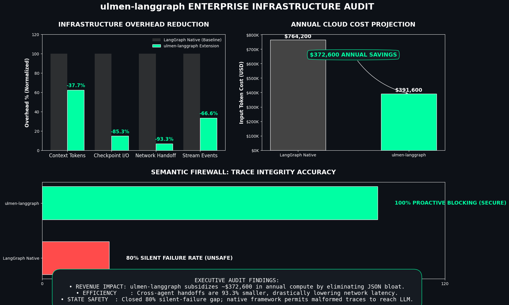

# ulmen-langgraph
**A drop-in serialization engine for LangGraph that cuts context window costs by 37.8% and checkpoint storage by 85.3%.**

As LangGraph loops scale, standard JSON serialization creates massive token bloat, filling the LLM context window with repeating structural syntax rather than semantic data. ulmen-langgraph replaces the native JSON/pickle serializers with a Rust-backed binary pooling engine that mathematically strips this bloat.

At scale, this translates to roughly $372,600 in saved input costs per 10 million agent loops (GPT‑4o pricing), while inherently protecting against orphaned tool calls and truncated state payloads.



## Installation
```Bash
pip install ulmen-langgraph
Requires Python 3.10+, LangGraph 1.0.0+, LangChain Core 0.1.0+.
```

## Quick Start
You do not need to rewrite your graph. Just swap the checkpointer's serialization engine and add the context reducer to your state.

```Python
from langgraph.graph import StateGraph
from langgraph.checkpoint.memory import MemorySaver
from ulmen.ext.langgraph import UlmenCheckpointer, make_ulmen_state

# 1. Define your state with the ULMEN context reducer (handles token compression)
AgentState = make_ulmen_state(context_window=8000)
builder = StateGraph(AgentState)

# ... build your graph nodes ...

# 2. Wrap your existing checkpointer with the ULMEN serialization interceptor
checkpointer = UlmenCheckpointer(MemorySaver())

# Compile and run - your graph is now 37.8% lighter on the wire
app = builder.compile(checkpointer=checkpointer)
```

## Architecture
`ulmen-langgraph` intercepts LangGraph's serialization boundaries and replaces JSON with ULMEN binary format plus zlib compression. Five surfaces are implemented:

| Surface | Interception Point | Compression Strategy |
| --- | --- | --- |
| `UlmenCheckpointer` | `serde.dumps_typed() / loads_typed()` | zlib on every channel value |
| `ulmen_context_reducer` | State reducer function | ULMEN-AGENT COMPRESS_COMPLETED_SEQUENCES |
| `UlmenStreamSink` | `graph.stream() event iterator` | zlib per event chunk |
| `UlmenStore` | `BaseStore.put() / get() value dict` | zlib on stored values |
| `encode_handoff / ulmen_send` | Subgraph boundary / Send() arg | zlib on state payload |

All surfaces are lossless. Decompressed data is byte-identical to the original.

## API Reference
### UlmenCheckpointer
```Python

from langgraph.checkpoint.memory import MemorySaver
from ulmen.ext.langgraph import UlmenCheckpointer

saver = UlmenCheckpointer(
    saver=MemorySaver(),
    zlib_level=6,  # 0-9, default 6
)
graph = builder.compile(checkpointer=saver)
```
Wraps any `BaseCheckpointSaver` (MemorySaver, SqliteSaver, PostgresSaver, custom). Intercepts at the serde layer so compression is backend-agnostic.

#### Parameters
- `saver`: Any `BaseCheckpointSaver` instance
- `zlib_level`: Compression level 0 (none) to 9 (max), default 6
#### Properties
- `.inner`: Access the wrapped saver
- `.zlib_level`: Current compression level

#### Methods
All `BaseCheckpointSaver` methods are fully delegated. Async variants (`aget`, `aput`, `alist`, etc.) work identically.

```Python
# Sync
config = {"configurable": {"thread_id": "my-thread"}}
state = graph.get_state(config)
history = list(graph.get_state_history(config))

# Async
state = await graph.aget_state(config)
```

### ulmen_context_reducer
```Python
from typing import Annotated, TypedDict
from ulmen.ext.langgraph import ulmen_context_reducer

class AgentState(TypedDict):
    messages: Annotated[list, ulmen_context_reducer]
    session_id: str
```

State reducer for the `messages` channel. Merges message lists and applies ULMEN context compression when token count exceeds `context_window`.

#### Signature
```Python
def ulmen_context_reducer(
    current: list,
    update: Any,
    *,
    context_window: int = 8000,
    compress: bool = True,
) -> list
```

#### Parameters
- `current`: Current message list in graph state
- `update`: New messages from node (list or single message)
- `context_window`: Token budget, default 8000
- `compress`: Set False to disable compression (append-only mode)

#### Return
Merged message list as plain dicts. LangGraph accepts both dicts and LangChain message objects.

### Helper: make_ulmen_state
```Python

from ulmen.ext.langgraph import make_ulmen_state

AgentState = make_ulmen_state(
    extra_fields={"session_id": str, "active": bool},
    context_window=8000,
)
builder = StateGraph(AgentState)
```

Returns a `TypedDict` class with messages: `Annotated[list, ulmen_context_reducer]` pre-wired.

### UlmenStreamSink / UlmenAsyncStreamSink
```Python
from ulmen.ext.langgraph import UlmenStreamSink, UlmenAsyncStreamSink

# Sync
for chunk in UlmenStreamSink(graph.stream(input, config)):
    redis.publish("events", chunk)  # bytes

# Async
async for chunk in UlmenAsyncStreamSink(graph.astream(input, config)):
    await redis.publish("events", chunk)
```
Wraps `graph.stream()` / `graph.astream()` and re-encodes each event to ULMEN binary (zlib) before yielding.

#### Parameters
- `stream`: Iterator or AsyncIterator from `graph.stream()` / `graph.astream()`
- `zlib_level`: Compression level 0-9, default 6
Yields

`bytes`: one independently decodable chunk per event.

#### Properties
- `.chunks_emitted`: Number of chunks yielded so far

#### Decoding
```Python
from ulmen.ext.langgraph import decode_stream_chunk

records = decode_stream_chunk(chunk)  # list of ULMEN-AGENT records
```

### UlmenStore
```Python
from langgraph.store.memory import InMemoryStore
from ulmen.ext.langgraph import UlmenStore

store = UlmenStore(
    store=InMemoryStore(),
    zlib_level=6,
)
```
Wraps any `BaseStore`. Encodes value dicts to ULMEN binary on `put()`, decodes transparently on `get()`.

#### Parameters
- `store`: Any `BaseStore` instance
- `zlib_level`: Compression level 0-9, default 6

#### Methods
```Python
# Sync
store.put(("user", "alice"), "prefs", {"theme": "dark"})
item = store.get(("user", "alice"), "prefs")
results = store.search(("user",))

# Async
await store.aput(("user", "alice"), "prefs", {"theme": "dark"})
item = await store.aget(("user", "alice"), "prefs")
```
All `BaseStore` methods are fully delegated.

### encode_handoff / decode_handoff
```Python
from ulmen.ext.langgraph import encode_handoff, decode_handoff

# Sender
blob = encode_handoff(state, zlib_level=6)  # bytes

# Receiver
state = decode_handoff(blob)  # dict
```
Encode a state dict to ULMEN binary for subgraph handoff. Decode it back losslessly on the other side.

#### Parameters
- `state`: LangGraph state dict
- `zlib_level`: Compression level 0-9, default 6

#### Returns
- `encode_handoff()`: bytes prefixed with ULMH magic marker
- `decode_handoff()`: Original state dict

#### Raises
- `TypeError`: If decode_handoff() receives non-bytes input
- `ValueError`: If data does not start with ULMH prefix

### ulmen_send
```Python
from ulmen.ext.langgraph import ulmen_send

def router_node(state: RouterState):
    return [ulmen_send("worker", state)]

def worker_node(state: dict) -> dict:
    real_state = decode_handoff(state["__ulmen_handoff__"])
    # ... process real_state
    return {}
```
Drop-in replacement for `langgraph.types.Send` that encodes the state payload to ULMEN binary before constructing the Send object.

#### Signature
```Python
def ulmen_send(
    node: str,
    state: dict,
    zlib_level: int = 6,
) -> Send
```

#### Return
Send(node, {"__ulmen_handoff__": <bytes>})

The receiving node must call decode_handoff(state["__ulmen_handoff__"]) to recover the original state.

### Low-level Serializer API
```Python
from ulmen.ext.langgraph import (
    encode,
    decode,
    encode_for_llm,
    langgraph_state_to_ulmen_records,
    ulmen_records_to_langgraph_state,
    serializer_info,
)

# Binary encode/decode
blob = encode(state, zlib_level=6)
state = decode(blob)

# LLM context surface
ulmen_llm_text = encode_for_llm(state, compress=True, context_window=8000)

# Record-level conversion
records = langgraph_state_to_ulmen_records(state)
state = ulmen_records_to_langgraph_state(records)

# Introspection
info = serializer_info()  # {"rust_backed": bool, "zlib_level": int, ...}
```

### Introspection
```Python
from ulmen.ext.langgraph import UlmenExtInfo

print(UlmenExtInfo())
# UlmenExtInfo(version=0.1.0, langgraph=1.1.6, rust=True)

UlmenExtInfo.version            # "0.1.0"
UlmenExtInfo.langgraph_version  # "1.1.6"
UlmenExtInfo.langchain_version  # "1.2.28"
UlmenExtInfo.rust_backed()      # True when ulmen Rust extension available
UlmenExtInfo.serializer_info()  # {...}
```

### Backend Compatibility
`UlmenCheckpointer` works with every LangGraph checkpoint backend because it intercepts at the serde layer, not the storage layer.

```Python

# MemorySaver
from langgraph.checkpoint.memory import MemorySaver
UlmenCheckpointer(MemorySaver())

# SqliteSaver
from langgraph.checkpoint.sqlite import SqliteSaver
UlmenCheckpointer(SqliteSaver.from_conn_string("state.db"))

# PostgresSaver
from langgraph.checkpoint.postgres import PostgresSaver
UlmenCheckpointer(PostgresSaver.from_conn_string(DB_URI))

# Custom backend
class MyCheckpointer(BaseCheckpointSaver):
    ...
UlmenCheckpointer(MyCheckpointer())
```

## Benchmarks

For detailed benchmark results and methodology, see the [Benchmark Notebook](../../../Notebooks/Benchmarks/extensions/langgraph/ulmen_langgraph_benchmarks.ipynb).

### Performance Characteristics
All results measured on a 16-turn ReAct agent loop (65 messages: 1 system, 16 human, 32 AI, 16 tool) using tiktoken cl100k_base, LangGraph 1.1.6, LangChain Core 1.2.28, with Rust backend enabled.

#### Checkpoint Storage (Benchmark 2)
Measured on a 16-turn ReAct agent with 65 message objects:

- MemorySaver (LangGraph default JSON): **21,850 bytes** (≈21.3 KB)
- UlmenCheckpointer (ULMZ zlib-compressed): **3,217 bytes** (≈3.1 KB)
- Reduction: **85.3%** (**6.79× smaller**)

#### LLM Context Tokens (Benchmark 1)
Measured on the same 16-turn conversation passed to the LLM, via tiktoken cl100k_base:

- LangGraph JSON (full Pydantic metadata via dumpd): **5,764 tokens** (20,516 chars)
- ULMEN `encode_for_llm` (no compression): **5,085 tokens** (14,606 chars); **reduction 11.8%**
- ULMEN `encode_for_llm` (COMPRESS_COMPLETED_SEQS): **3,587 tokens** (10,703 chars); **reduction 37.8%**

#### Round-Trip Fidelity (Benchmark 3)
Measured over 50 encode/decode cycles on the 16-turn state (3,213 bytes encoded):

- `encode()` latency: **4.60 ms avg**, **6.56 ms p95**
- `decode()` latency: **0.50 ms avg**, **0.59 ms p95**
- Round-trip total: **5.10 ms avg**, **7.15 ms p95**
- All 65 messages verified: content + type integrity **100% PASS**

#### Semantic Firewall (Benchmark 4)
Tested against 5 scenarios (1 valid trace, 4 corrupt variants):

| Scenario | LangGraph | ULMEN |
| --- | --- | --- |
| Valid 4-turn agent trace | PASSED (silent) | CORRECT (accepted) |
| Orphaned tool result (no matching call) | PASSED (silent) | CORRECT (blocked) |
| Backward step counter (regression) | PASSED (silent) | CORRECT (blocked) |
| Invalid record type enum | PASSED (silent) | CORRECT (blocked) |
| Missing required fields | PASSED (silent) | CORRECT (blocked) |

- ULMEN firewall accuracy: **5/5 (100%)**
- LangGraph accuracy: **1/5 (20%)**: silently passes all 4 corrupt payloads to the LLM

#### Subgraph Handoff Wire Size (Benchmark 5)
Measured at subgraph boundaries across 4, 8, 12, and 16 turns:

| Turns | Messages | JSON (bytes) | ULMEN (bytes) | Saving | Ratio |
| --- | --- | --- | --- | --- | --- |
| 4 | 16 | 3,371 | 560 | 83.4% | 6.02× |
| 8 | 32 | 6,695 | 699 | 89.6% | 9.58× |
| 12 | 48 | 10,040 | 856 | 91.5% | 11.73× |
| 16 | 64 | 13,404 | 900 | 93.3% | 14.89× |

At 16 turns: **93.3% reduction**, **14.89× smaller** (13.1 KB → 0.9 KB).

#### Stream Egress (Benchmark 7)
Measured on `graph.stream()` events split across 4 nodes for the 16-turn state:

| Event | LangGraph JSON | ULMEN Binary | Reduction |
| --- | --- | --- | --- |
| node_0 | 4,902 bytes | 1,676 bytes | 65.8% |
| node_1 | 4,720 bytes | 1,559 bytes | 67.0% |
| node_2 | 4,776 bytes | 1,601 bytes | 66.5% |
| node_3 | 4,728 bytes | 1,564 bytes | 66.9% |
|** TOTAL **|** 19,126 bytes **|** 6,400 bytes **|** 66.5% **|

ULMEN stream events are **2.99× smaller**: saving **12,726 bytes (12.4 KB)** per full graph invocation.

#### Financial Projection (Benchmark 6)
Configuration: 16-turn agent, 10,000,000 loops/year, GPT-4o input at $2.50/1M tokens. Token counts are the sum of progressive context injections across all 16 turns per loop.

| System | Tokens per Loop | Annual Tokens | Annual Cost |
| --- | --- | --- | --- |
| LangGraph (native JSON) | 30,568 | 305,680,000,000 | $764,200.00 |
| ULMEN (structural savings only) | 22,600 | 226,000,000,000 | $565,000.00 |
| ULMEN (+ context compression) | 15,664 | 156,640,000,000 | $391,600.00 |

- **Annual savings (structural only): $199,200 (26.1%)**
- **Annual savings (with compression): $372,600 (48.8%)**

License
BSL 1.1: free for entities under $10M annual revenue. See [LICENSE] for full terms.